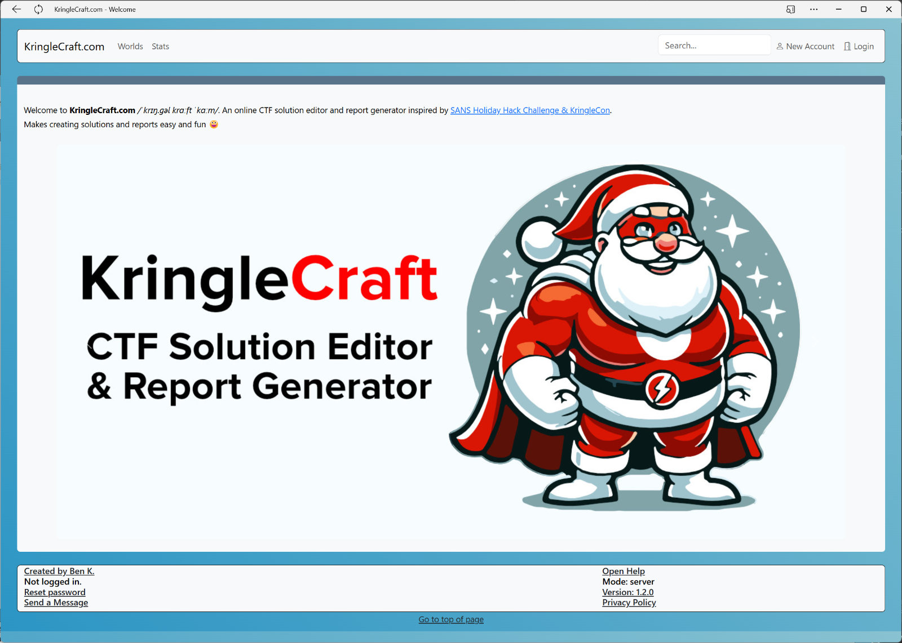

# KringleCraft
KringleCraft, a CTF solution editor and report generator inspired by the SANS Holiday Hack Challenge & KringleCon.

## About

KringleCraft.com is an online CTF solution editor and report generator inspired by the SANS Holiday Hack Challenge & KringleCon. 
The SANS Holiday Hack Challenge takes place every year during the Christmas holiday season and offers a lot of challenges, knowledge, fun and interaction with other players.
You can even write a report with your solutions and win valuable prizes.  
In 2021, I created a report in Markdown format (Markdown is the ideal format for documentation, in my opinion, as it is easy to learn and use and offers syntax highlighting out of the box).
I invested a lot of time to create a nice and well-structured report, so I had the idea to automate the whole thing.   
By 2022, I had simple Python scripts that prepared the data for me as a report.  
I continued to work on it from late 2023 to mid-2024, and now I have a solution written in Python using the Flask and Bootstrap frameworks. 
The data is stored in an SQLite database and additional files, such as images, are stored in the local file system. 
This makes the application very portable and can run on any operating system with minimal dependencies.  
It can be used directly on a client, and in combination with a web server (e.g., Apache) as a proxy and the WSGI middleware, it can also be easily made available on the Internet.  
My application is, of course, inspired by Kringle Con, but is flexible enough to be used for any CTF scenario.   
The instance available at [KringleCraft.com](https://www.kringlecraft.com) contains my reports for 2021, 2022 and 2023.

## Features

What can the application do?

- The application supports any CTF scenario (also called *world*, based on the Kringle Cons). These can contain *rooms*, which can contain *objectives*
- There are different roles (admins, standard users and anonymous users)
    - An admin can design a whole world or a whole CTF scenario, including the rooms and challenges
    - A registered user can write a solution for each challenge, upload files for it, and generate reports
    - An anonymous user can view all worlds, rooms and challenges, as well as public solutions
- The application supports easy user registration.
    - There is a simple email-based registration workflow
- There are public and private worlds and public and private solutions.
    - An admin can make a world public, before that no one can see solutions created by other users (a key requirement for many CTFs as well as Hack Fest)
    - A registered user can decide for each solution whether it should be public or hidden
- There is a simple email dispatcher
    - Emails are sent for important events (e.g. password changes or when a world is made public)
- The application makes it easy to create reports
    - HTML reports are fully linked and offer the best layout
    - A registered user can create and distribute invitation links so that reports can be viewed by reviewers before a world is made public
    - Markdown reports are also fully linked and can be customized later
- And much more, which can be seen in the respective help pages
