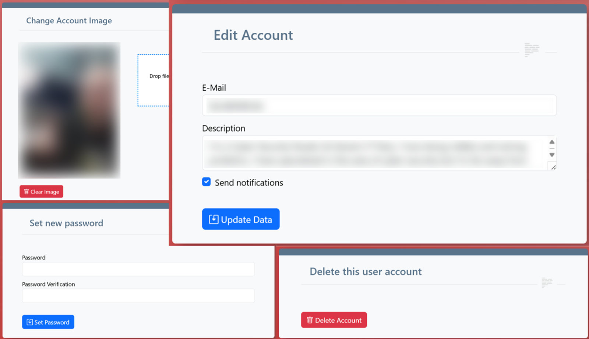

# Account Management

## My Account

You can manage your account in the *My Account* section. The following areas are available:  

- Under *Change Account Image* you can upload a profile picture that will be visible to all registered users in the *Users* section. 
    - This will also be used as the author's picture for the reports generated. 
    - You can also delete an uploaded picture here.
- Under *Edit Account* you can change your e-mail address. 
    - Please note that this is used as your username for logging in and that password reset mails can only be sent to this address. 
    - Under *Description* you can enter information about yourself that will also be displayed in the *Users* section and on the reports. 
    - With *Send notifications* you can choose whether you want to receive e-mails from the system (e.g. when a world is made public)
- Under *Set new password* you can choose a new password, which will then be used for future logins
- Under *Delete this user account* you can delete your entire account. 
    - Please note that this will also delete all the solutions you have created. 
    - Content created by administrators, such as worlds, rooms, objectives and challenges, will remain even if the admin account is deleted.

## Reset Password

You can use *Reset Password* to reset your password if you have forgotten it.  
To do this, you must enter the e-mail address that you use for your account.  
You will then receive an e-mail with a link.  
If you click on the link, you will be taken to a page where you can assign a new password.
