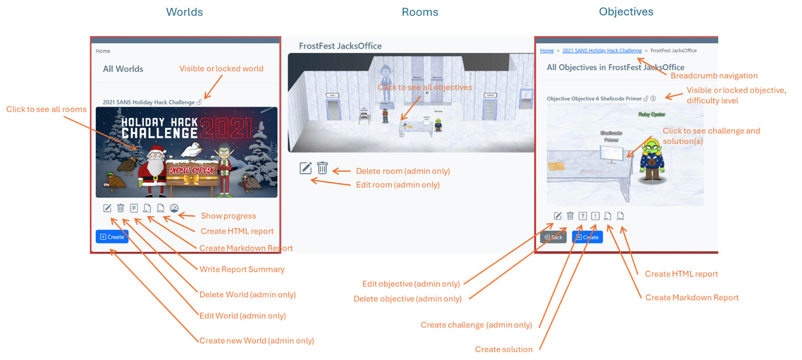
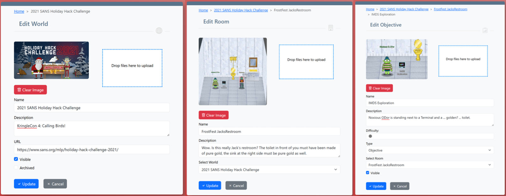

# Enter Data

## Elements and Options

There are three types of elements, which are arranged hierarchically:

- Worlds: contain individual rooms and represent a complete (CTF) scenario
- Rooms: contain individual objectives in order to group them further
- Objectives: a single task that needs to be solved

The main functions for each element can be seen here:
Note that some functions (e.g. creating, changing and deleting elements) are only available to an admin.

## Edit Elements

When creating or changing elements, you can enter various pieces of information.  
A name is always required so that the element can be found again later.  
The description is optional, but it is displayed in the reports and can further describe the element.  
The following special options are available:

- *Visible* (world): Decides whether solutions created in a world are visible to everyone. Otherwise, they are only visible to the creator. Many CTFs have deadlines, and solutions may only be made public after these deadlines have passed.
- *Archived* (world): If a world is archived, it does not appear in the index carousel.
- *Select World*/*Select Room*: Rooms and objectives can also be moved to other elements above them in the hierarchy
- *Difficulty* (objective): Shows the level of difficulty
- *Type* (objective): Can be either objective/character/item to specify the type more precisely
- *Visible* (objective): Decide whether the objective is visible in the reports created. This allows you to hide irrelevant elements

A picture can also be uploaded for each element or an existing picture can be deleted.  
This appears on the generated reports and in the overview.  

