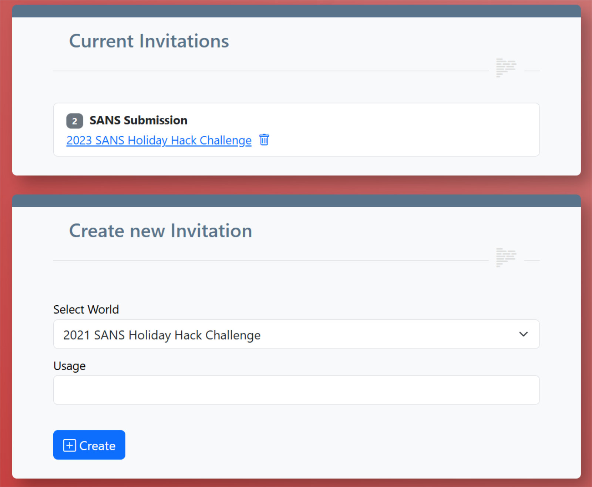

# Invitation Links

A link can also be generated for a complete report, which you can send to an auditor by e-mail, for example.  
The auditor can view your report even if the world is not yet public, for example, before the submission deadline.  
This means that your report can easily be submitted and evaluated.  
You can also see how often your link has been accessed.  

