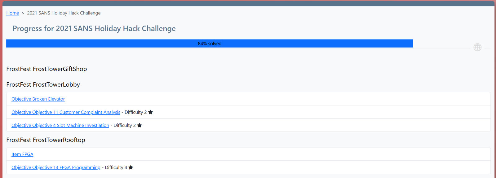
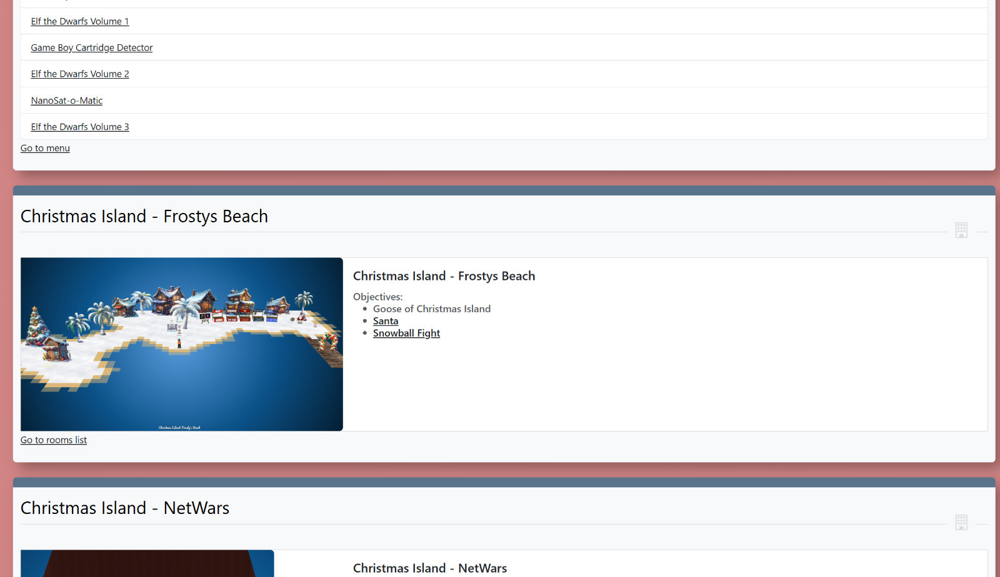
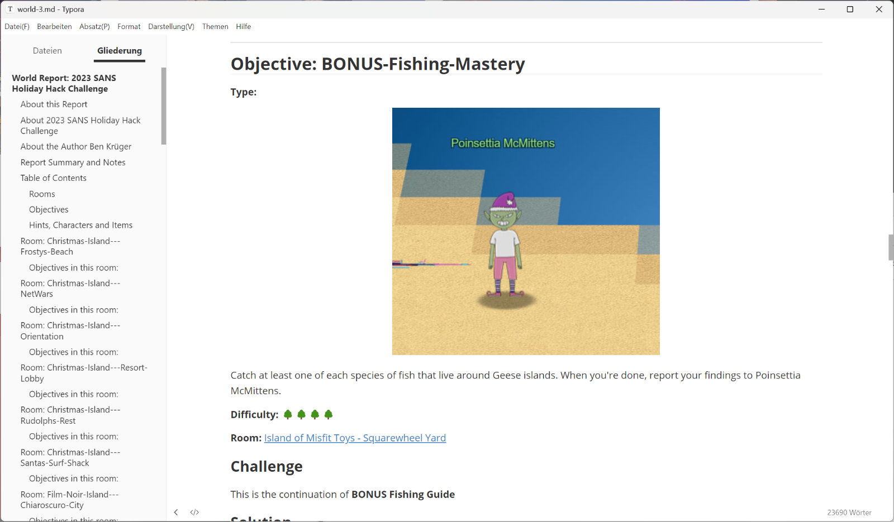

# Report Creation

## Progress Bar

The *Show Progress* can be used to display all the objectives in the world and to navigate directly to them.  
It is also easy to see which ones have which difficulty and whether they have already been started or completed. 

## HTML Reports

A report can be created for an entire world or for a single objective.  
The HTML report contains information about the respective world, the author of the solutions, 
additional information about the report, as well as all rooms and objectives with associated solutions.  
The report is fully linked, so you can navigate easily to any part of it.  

## Markdown Reports

The report can also be downloaded in Markdown format.  
This makes it easy to edit and export to other formats.  
This report is also fully linked.  

