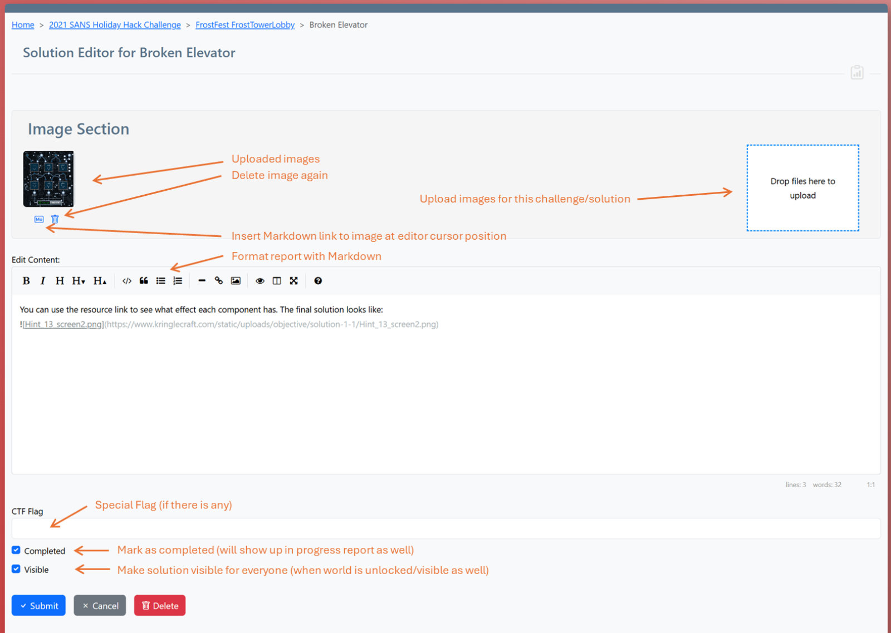
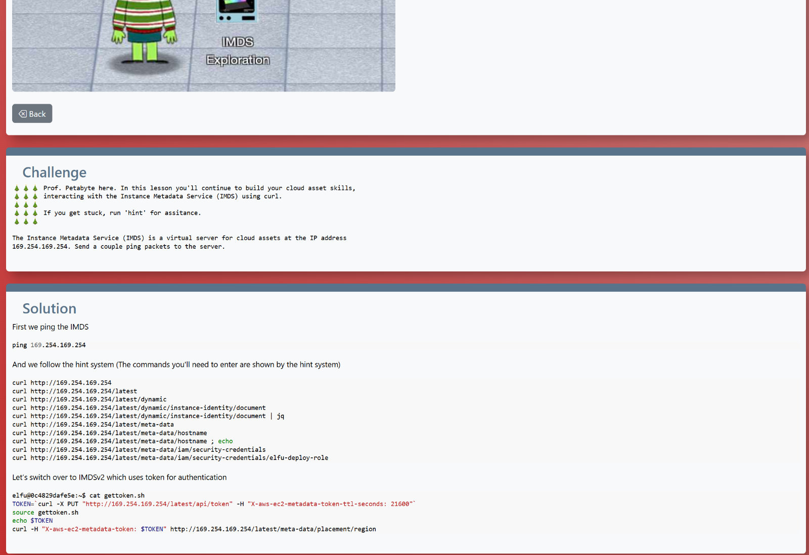

# Create Challenges and Solution

## Use the Markdown editor and image upload bar

For each objective, a challenge (the task to be solved) and a solution can be created.  
Both are done using the built-in Markdown editor, which supports the usual Markdown syntax.  
Creating/modifying challenges and solutions is very similar:  

## See own/other solutions

Once created, solutions can be viewed by others if both the world (by the admin) and the solution (by the creator) have been marked as visible. 

